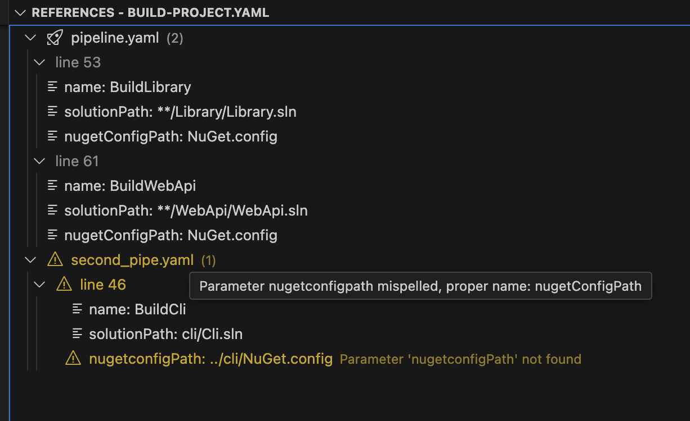
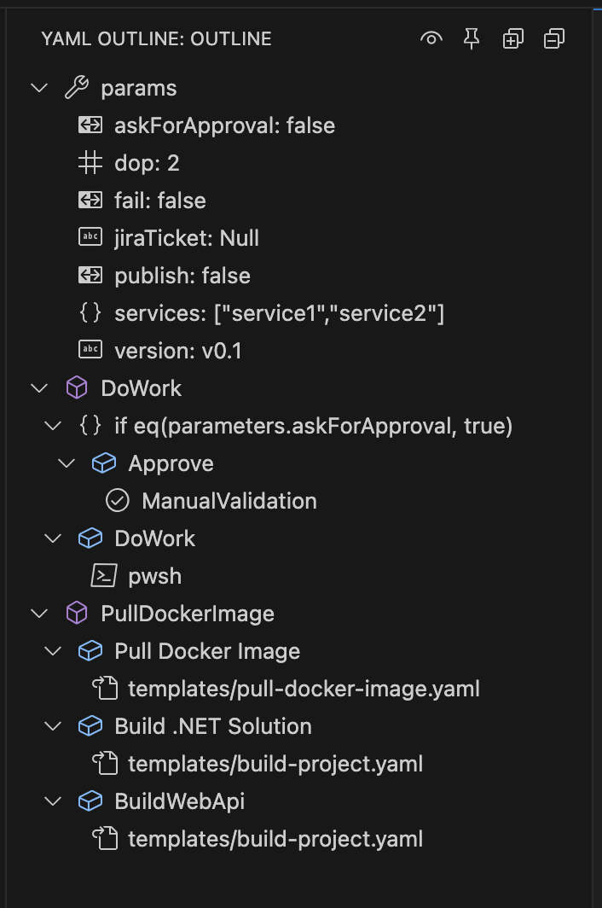
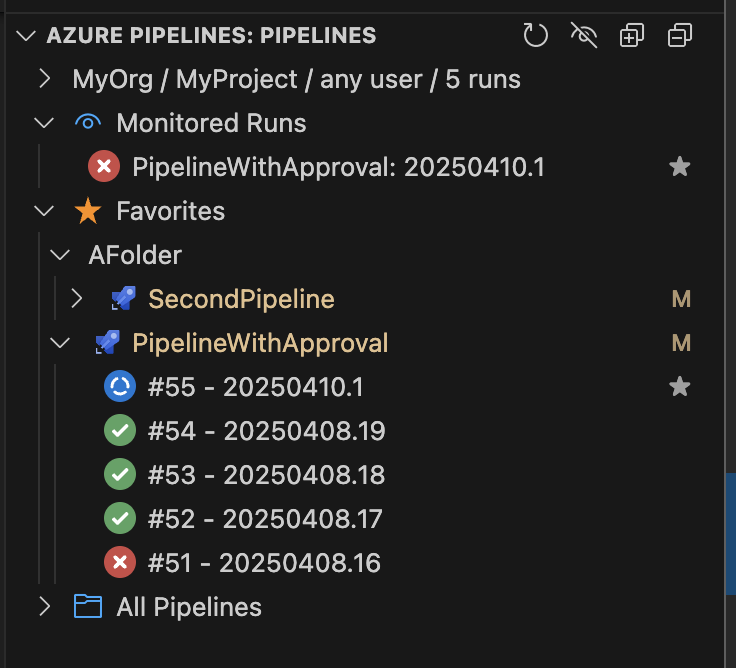

Introduces 3 new views

- References
- Outline
- Pipelines

Other features:
- Render: calls the Azure Devops API to generate the full YAML, rendering all chidren templates. Useful for debugging the final YAML, as generated by ADO

- List Dependencies: inspect the YAML and lists all referenced templates, including the ones defined in remote repositories (note: requires configuring a mapping). Useful when troubleshooting the [100 templates limit](https://learn.microsoft.com/en-us/azure/devops/pipelines/process/templates?view=azure-devops&pivots=templates-includes#imposed-limits-on-template-updates).

# References

Right-click a file in Explorer or on the tab header and click "Find References". A tree of references to this file will be displayed, along with all the call parameters.

# Outline

Easily navigate large YAMLs by using the outline view, which will display a structure of the pipeline.
Clicking a node will take you to the line where that node is declared.

# Pipelines

Displays all ADO pipelines in a certain project (requires an ADO PAT).

On demand, you can fetch a list of recent builds per pipeline.
You can monitor long-running builds and you will receive a notification when they finish.

